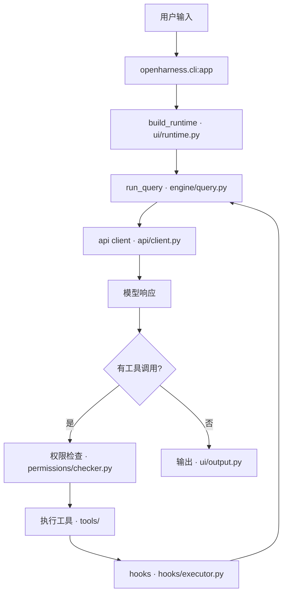

# s00 · 环境搭建与源码地图

> 执行手册：[`../../stages/s00-environment/RUNBOOK.md`](../../stages/s00-environment/RUNBOOK.md)（15 步详细操作，含每个命令的参数说明与预期输出）
> 基准：`HKUDS/OpenHarness` @ `9b2efd7`（v0.1.9）｜ 环境：Windows + PowerShell + Python 3.12.13 ｜ 记录日期：2026-09-12
> 实验目录：`C:\code\OhAgent\.refs\OpenHarness`（只读快照，不改动、不提交）

---

## 1. 源码地图

### 1.1 顶层目录职责

| 顶层路径 | 职责 | 验证方式 |
|---|---|---|
| `src/openharness/` | Harness 核心，实测 229 个 .py / 39,303 行 | RUNBOOK 步骤 12 |
| `ohmo/` | 个人智能体 App（独立入口 `ohmo`），含 `gateway/` | `pyproject.toml` 中 `ohmo = "ohmo.cli:app"` |
| `frontend/terminal/` | React 终端前端 | `pyproject.toml` 的 force-include 把它打进 wheel |
| `autopilot-dashboard/` | Vite 看板 | 顶层目录存在 |
| `tests/` | 约 100 个测试模块，按模块镜像组织 | RUNBOOK 步骤 13 |
| `scripts/` | 安装脚本 + 端到端验证脚本，共 15 个文件 | `install.ps1` / `e2e_smoke.py` / `test_harness_features.py` |
| `.github/workflows/` | `ci.yml` + 3 个 autopilot 工作流 | 目录列表 |

### 1.2 入口点

| 命令 | 目标 | 说明 |
|---|---|---|
| `oh` / `openharness` / `openh` | `openharness.cli:app` | 通用 Agent CLI，同一应用三个别名 |
| `ohmo` | `ohmo.cli:app` | 独立"个人智能体"App，有自己的人设、记忆与通道 |

### 1.3 CLI 结构（实测）

- `oh` 的选项分 8 组：Options / Session / Model & Effort / Output / Permissions / System & Context / Advanced / Commands。
- 子命令 8 个：`setup` `mcp` `plugin` `auth` `provider` `config` `cron` `autopilot`。
- 按能力分层：接入（`auth` / `provider`）→ 配置（`config`）→ 扩展（`mcp` / `plugin`）→ 自动化（`cron` / `autopilot`）→ 交互入口（`setup`）。
- 三个最关键的旗标：`-p/--print`（headless）、`--dry-run`（只解析不执行）、`--permission-mode`（default / plan / full_auto）。

---

## 2. 我理解到的机制

### 2.1 三种运行形态

| 形态 | 命令 | 链路 | 是否触达模型 |
|---|---|---|---|
| 交互 | `oh` | `cli:app` → 装配 → TUI 等待输入 | 用户提交后才触达 |
| 无头 | `oh -p "..."` | `cli:app` → 装配 → `run_query` 循环 → 按 `--output-format` 输出 | 是 |
| 预览 | `oh --dry-run` | 解析 settings / auth / prompt / skills / commands / tools / MCP → 打印报告 | 否 |

### 2.2 装配与执行分离（本阶段最重要的认知）

- 装配点在 `ui/runtime.py` 的 `build_runtime`：它决定这次会话接进哪些能力（工具、技能、插件、hooks、MCP）。
- `--bare` 能关掉 hooks / plugins / MCP 与自动发现，正是因为这些能力是在**装配阶段**被选择性接入的，而不是硬编码在引擎里。
- 推论：企业要"裁剪能力"，优先找装配点，而不是改引擎。

### 2.3 解析后视图 vs 文件原文

- 文件原文：`settings.json`（默认 `C:\Users\Administrator\.openharness\settings.json`）。
- 解析后视图：`oh config show` / `oh --dry-run` 的输出，已合并环境变量、默认值、profile 覆盖，并对敏感字段做 `[REDACTED]` 处理。
- 排查配置问题**永远看解析后视图**，因为原文不是最终生效值。
- 隔离开关：`OPENHARNESS_CONFIG_DIR` / `OPENHARNESS_DATA_DIR` / `OPENHARNESS_LOGS_DIR`（`config/paths.py` 第 19 / 41 / 58 行附近）。

### 2.4 同一状态，两种语义

| 形态 | 无凭据时的行为 | 退出码 |
|---|---|---|
| `oh --dry-run` | 输出 `Readiness: warning` + `next actions`，正常结束 | 0 |
| `oh -p "..."` | 报 `Error: No API key configured.`，拒绝执行 | 1 |

预览时缺凭据是**信息**，执行时是**错误**——这是 dry-run 的设计意图，也是 CI 门禁要区分的两种状态。

---

## 3. 实验与证据

> 完整命令与逐段解读见 RUNBOOK；此处只留结论与关键数字。

| # | 实验 | 命令 | 实测结果 |
|---|---|---|---|
| A | 快照确认 | `git rev-parse --short HEAD` / `git status --short` | `9b2efd7`，工作区干净 |
| B | 环境与版本 | `uv sync --extra dev` / `uv run oh --version` | `openharness 0.1.9` |
| C | CLI 总览 | `uv run oh --help` | 8 个选项分组 + 8 个子命令 |
| D | 认证矩阵 | `uv run oh auth status` | 12 个认证来源 + 11 个 profile，全部 `missing`，激活项 `claude-api` |
| E | profile 列表 | `uv run oh provider list` | 11 个内置 profile；5 个 `base_url=(default)` |
| F | 配置脱敏 | `uv run oh config show` | JSON，敏感字段显示 `[REDACTED]` |
| G | 扩展现状 | `uv run oh mcp list` / `plugin list` / `cron status` | 均空：无 MCP、无插件、调度器 stopped |
| H | 环境体检 | `uv run oh --dry-run` | `warning`；model `claude-sonnet-4-6`；prompt 7977 字符；plugins 0 / skills 10 / commands 69 / tools 39 |
| I | 体检 JSON | `uv run oh --dry-run -p "hello" --output-format json` | `entrypoint.kind = model_prompt`（对比交互形态的 `interactive_session`） |
| J | 认证门禁 | `uv run oh -p "Explain this repository"` | `No API key configured.`，退出码 1 |
| K | 行数统计 | PowerShell 递归统计 `src/openharness/**/*.py` | 229 文件 / 39,303 行 |
| L | 测试基线 | `uv run pytest -q -p no:cacheprovider` | 收集中断（mcp 2.x）；加 `--ignore` 后 25 failed / 1122 passed / 11 skipped / 275.64s |

### 关键数字（可作为后续"配置漂移"参照）

- `system prompt chars: 7977`
- `skills: 10`、`slash commands: 69`、`built-in tools: 39`
- 巨型文件 Top5：`commands/registry.py` 2590、`cli.py` 2250、`autopilot/service.py` 2089、`services/compact/__init__.py` 1542、`channels/impl/feishu.py` 1146

---

## 4. 疑问与待验证

- [ ] `mcp 2.2.0` 与上游不兼容（`FastMCP` 改名 `MCPServer`）→ 验证方式：`uv add "mcp<2"` 后重跑 `tests/test_mcp/`，看是否全绿；或读 `src/openharness/mcp/client.py` 确认上游用到的 API。
- [ ] `docs/03-cli-index.md` 原写"斜杠命令 62 个"，dry-run 实测 **69** → 验证方式：读 `commands/registry.py` 统计注册项，确认差额是否来自 skills 自动注册（见 `_register_user_invocable_skill_commands`）。
- [ ] 25 个失败是否全部为环境因素（无凭据 / Windows / 只读沙箱）→ 验证方式：在可写且带凭据的环境重跑，对比失败集合差异。
- [ ] `--dry-run` 的 readiness 在什么条件下从 `warning` 升级为 `blocked`？→ 验证方式：构造一个必然失败的配置（如错误的 api_format）再跑 dry-run。

---

## 5. 企业视角

把"环境 + 基线"能力放进公司平台，缺口有三个：

1. **依赖不可复现**：`pyproject.toml` 里 `mcp>=1.0.0` 无上界，v2 直接破兼容 → 内部发行版必须锁版本并做依赖审计。
2. **基线不可比对**：缺少"每个版本存一份测试基线"的机制，升级是否引入回归无法判断。
3. **平台差异未覆盖**：Windows 下 25 个失败说明上游 CI 只覆盖 Linux，而企业桌面交付常常在 Windows。

---

## 6. 我的执行记录（执行时填写）

| RUNBOOK 步骤 | 是否执行 | 与预期是否有差异 | 差异原因 / 备注 |
|---|---|---|---|
| 0.1 打开工作目录 | | | |
| 0.2 隔离环境变量 | | | |
| 1 快照版本 | | | |
| 2 安装依赖 | | | |
| 3 CLI 总览 | | | |
| 4 子命令巡览 | | | |
| 5 ohmo | | | |
| 6 auth status | | | |
| 7 provider list | | | |
| 8 config show | | | |
| 9 dry-run | | | |
| 10 dry-run JSON | | | |
| 11 认证门禁 | | | |
| 12 行数统计 | | | |
| 13 测试基线 | | | |
| 14 链路草图 | | | |
| 15 验收自测 | | | |

### 我的链路草图（步骤 14 产出）

> 待修正点（留给 s04）：`run_query` 内部的循环边界、流式事件如何回传、装配阶段具体注入了哪些组件。